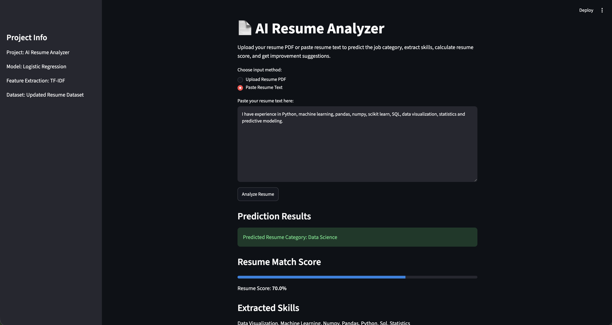
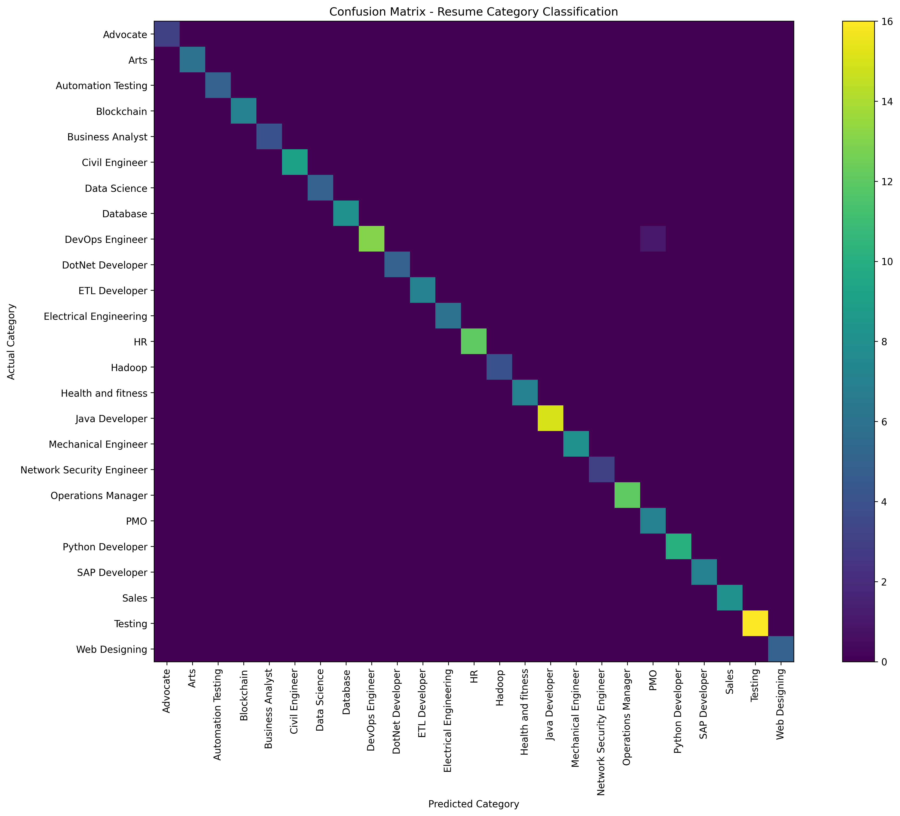

# Project 04 - AI Resume Analyzer

## Overview

AI Resume Analyzer is a machine learning and NLP-based web application that analyzes resumes and predicts the most suitable job category. The system can accept resume text directly or extract text from uploaded PDF resumes. It also identifies skills, calculates a resume match score, shows missing skills, and gives improvement suggestions.

This project was built as a real-time data science portfolio project using Python, Scikit-learn, NLP, and Streamlit.

---

## Problem Statement

Many job seekers apply for roles without knowing whether their resume matches the required job category or skill expectations. Recruiters also spend time manually screening resumes. This project helps automate resume screening by predicting the job category and providing useful resume improvement insights.

---

## Dataset

Dataset used:

**Updated Resume Dataset**

The dataset contains resume text and corresponding job categories such as:

- Data Science
- Java Developer
- Python Developer
- Web Designing
- HR
- DevOps Engineer
- Testing
- Business Analyst
- Database
- And other job categories

---

## Features

- Upload resume as PDF
- Paste resume text manually
- Extract text from PDF resumes
- Clean resume text using NLP preprocessing
- Predict suitable resume category
- Extract technical skills
- Calculate resume match score
- Show matched skills
- Show missing skills
- Provide improvement suggestions
- Display cleaned resume preview

---

## Technologies Used

- Python
- Pandas
- NumPy
- Scikit-learn
- Matplotlib
- PDFPlumber
- Streamlit
- Pickle

---

## Machine Learning Approach

The project uses Natural Language Processing techniques to convert resume text into numerical features.

### Steps followed:

1. Loaded the resume dataset
2. Checked dataset shape, columns, missing values, and category distribution
3. Cleaned resume text by removing URLs, symbols, special characters, and extra spaces
4. Converted text into numerical vectors using TF-IDF Vectorizer
5. Split the dataset into training and testing data
6. Trained a Logistic Regression classification model
7. Evaluated the model using accuracy score, classification report, and confusion matrix
8. Saved the trained model and vectorizer using Pickle
9. Built a Streamlit web application for real-time resume analysis

---

## Model Used

### Logistic Regression

Logistic Regression was used because it performs well for text classification problems when combined with TF-IDF features. It is also fast, simple, and easy to explain compared to complex deep learning models.

---

## Model Performance

The model achieved an accuracy of approximately:

```text
99.48%

## Application Screenshot


## Confusion Matrix
